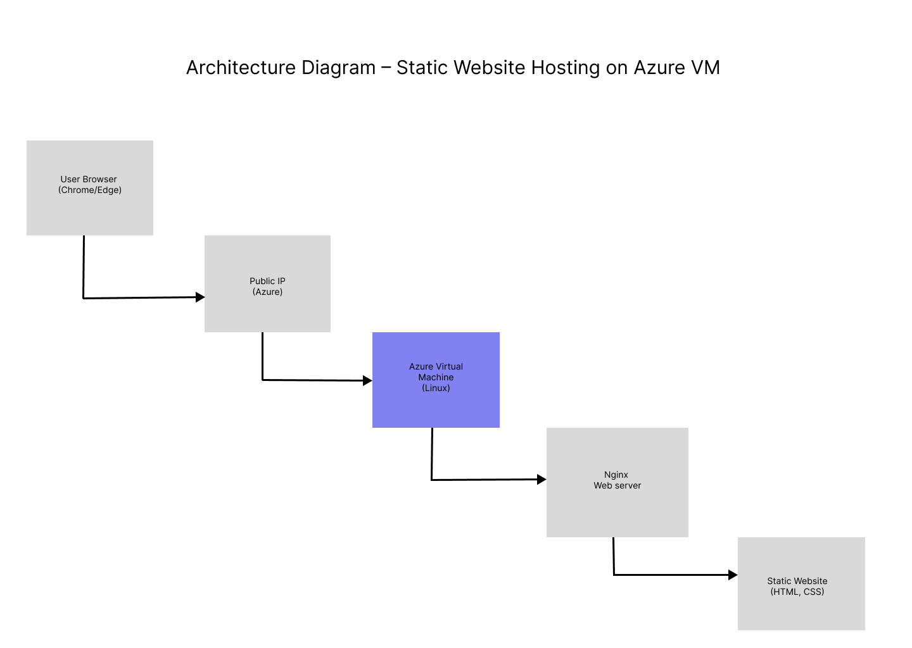
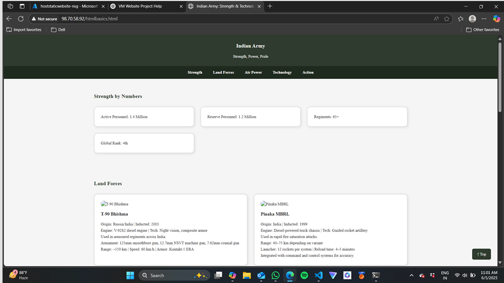
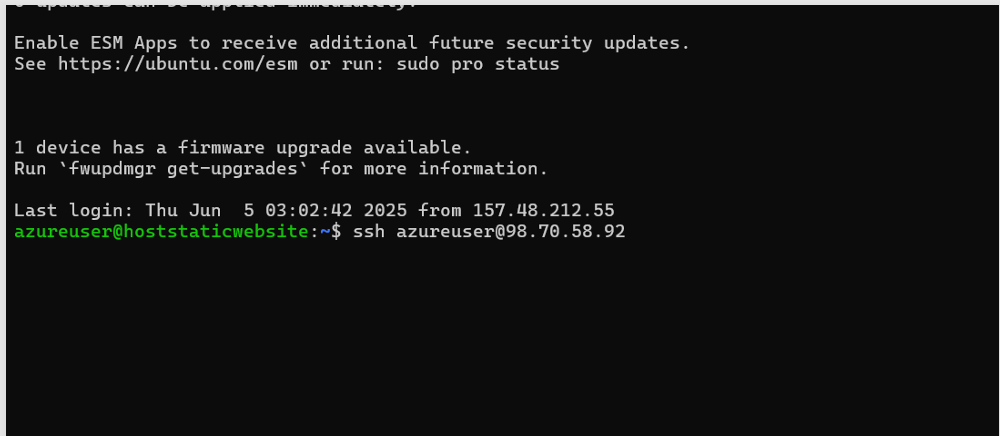

# Azure VM Static Website Hosting

## Overview
This project demonstrates hosting a static website on **Microsoft Azure** using a **Linux-based Virtual Machine** and the **Nginx web server**.  
It covers VM creation, networking configuration, server setup, website deployment, and public access verification.

---

## Architecture Diagram
The architecture below illustrates how user requests are routed through a public IP
to an Azure Virtual Machine running Nginx, which serves static HTML and CSS files.

---

## Implementation Steps
- Created a Linux (Ubuntu) Virtual Machine on Microsoft Azure  
- Configured networking and security rules using Network Security Groups (NSG)  
- Connected to the VM securely via SSH  
- Installed and configured the Nginx web server  
- Deployed static website files to the server  
- Verified website accessibility using the VM’s public IP  

---

## Screenshots

### Website Access via Public IP

### SSH Access to Azure Virtual Machine

Additional screenshots related to VM setup, networking, and deployment
are available in the `screenshots` folder.

---

## Project Evidence
📄 A detailed step-by-step project report with screenshots is available here:  
**Azure_Static_Website_Project_Report.pdf**

---

## Tech Stack
- Microsoft Azure  
- Azure Virtual Machine  
- Ubuntu Linux  
- Nginx Web Server  
- HTML, CSS  

---

## Cost Note
All Azure resources were stopped or deleted after successful deployment
to avoid unnecessary cloud costs.

---

## Skills Demonstrated
- Cloud infrastructure deployment (Azure VM)  
- Linux server administration  
- Networking and security configuration (NSG)  
- Web server setup (Nginx)  
- SSH-based remote access  
- Cloud cost awareness  
- Technical documentation  

---

## Note
This project was executed using a shared Azure student account for learning purposes.  
All configuration, deployment, and documentation work was performed by me.

---

**Author:** Nikhil Singh
